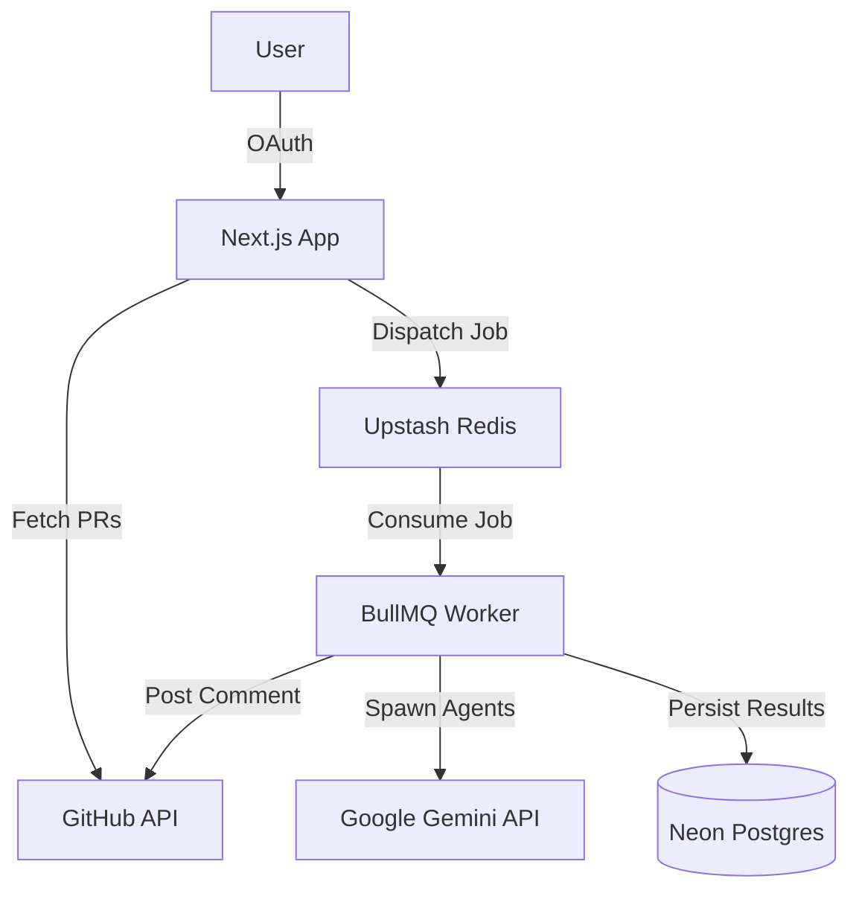

<div align="center">

# 🌊 ReviewFlow AI

**The Intelligent, Multi-Agent Pull Request Orchestrator**

[](https://nextjs.org/)
[](https://www.typescriptlang.org/)
[](https://docs.bullmq.io/)
[](https://ai.google.dev/)
[](https://www.prisma.io/)

[Features](#-features) • [Architecture](#-architecture) • [Getting Started](#-getting-started) • [Deployment](#-deployment)

</div>

---

1. 🛡️ **Security Agent**: Scans for vulnerabilities, OWASP violations, and secret leaks.
2. ⚡ **Performance Agent**: Identifies algorithmic bottlenecks, memory leaks, and inefficient queries.
3. 💎 **Quality Agent**: Enforces clean code principles, DRY, and syntax best practices.
4. 🏗️ **Architecture Agent**: Evaluates structural integrity, dependency cycles, and design patterns.
5. 🧪 **Test Coverage Agent**: Assesses edge cases, missing assertions, and testability.

An **Orchestrator** then synthesizes these findings into a unified, actionable report and automatically publishes it as a comment directly on your GitHub Pull Request.

---

## ✨ Features

- **GitHub Integration**: Native OAuth login and seamless repository/PR syncing.
- **Headless Queueing**: Highly robust background job processing using **BullMQ** and **Upstash Redis**.
- **Real-Time Streaming**: Watch agents work in real-time on the dashboard via **Server-Sent Events (SSE)**.
- **Smart Scoring**: Automatically calculates a risk score (0-100) and recommends `APPROVE`, `REQUEST_CHANGES`, or `COMMENT`.
- **Database Persistence**: Fully typed relational data storage powered by **Neon Serverless Postgres** and **Prisma 7**.

---

## 🏗️ Architecture

ReviewFlow operates across two primary environments for maximum scale:

1. **Frontend / API (Vercel)**: Next.js App Router handling GitHub OAuth, user dashboards, and API routing.
2. **Background Worker (Railway)**: A standalone Node.js process executing BullMQ queues, delegating AI workloads to the Gemini API, and handling long-running background tasks.



---

## 🚀 Getting Started (Local Development)

### Prerequisites

- **Node.js** >= 20.0.0
- **Redis** instance (Local or Upstash)
- **Postgres** database (Local or Neon)
- **GitHub OAuth App** credentials
- **Google Gemini API Key**

### 1. Clone the repository
```bash
git clone https://github.com/Shantanu112-bd/ReviewFlow-Ai.git
cd ReviewFlow-Ai
npm install
```

### 2. Environment Setup
Copy the template and fill in the required variables:
```bash
cp .env.example .env
```
Ensure you provide:
- `DATABASE_URL` (Postgres)
- `REDIS_URL` (Redis)
- `GITHUB_CLIENT_ID` & `GITHUB_CLIENT_SECRET`
- `GEMINI_API_KEY`
- `BETTER_AUTH_SECRET` & `BETTER_AUTH_URL`

### 3. Initialize the Database
```bash
npx prisma generate
npx prisma db push
```

### 4. Start the Application

You must run the Frontend and the Background Worker simultaneously:

**Terminal 1 (Frontend):**
```bash
npm run dev
```

**Terminal 2 (Worker):**
```bash
npm run start:worker
```

Visit `http://localhost:3000` to log in with GitHub and start reviewing PRs!

---

## 📦 Deployment

ReviewFlow AI is built for a distributed deployment strategy:

### Web Application (Vercel)
1. Import the repository into Vercel.
2. Set the Framework Preset to **Next.js**.
3. Supply all `.env` variables.
4. Deploy.

### Background Worker (Railway / Render / Fly.io)
1. Deploy the repository using the included `Dockerfile` or `railway.json`.
2. Override the start command to: `npm run start:worker`.
3. Supply the exact same `.env` variables as Vercel.

*(For detailed instructions, refer to `DEPLOYMENT_GUIDE.md`)*

---

## 🤝 Contributing

Contributions are welcome! If you'd like to add a new Specialized Agent, improve the Orchestrator prompt, or tweak the UI:

1. Fork the Project
2. Create your Feature Branch (`git checkout -b feature/AmazingFeature`)
3. Commit your Changes (`git commit -m 'Add some AmazingFeature'`)
4. Push to the Branch (`git push origin feature/AmazingFeature`)
5. Open a Pull Request

---

## 📜 License

Distributed under the MIT License. See `LICENSE` for more information.

---
<div align="center">
  <i>Built with ❤️ for better, faster code reviews.</i>
</div>
