# ReviewFlow AI - Database Design

## 2. Entity Relationship Diagram

Below is the conceptual entity relationship diagram mapping directly to the Prisma schema configuration.

```mermaid
erDiagram
    USER ||--o{ REPOSITORY : "owns"
    USER ||--o{ REVIEW : "performs"
    REPOSITORY ||--o{ PULLREQUEST : "contains"
    PULLREQUEST ||--o{ REVIEW : "has"
    REVIEW ||--o{ AGENTRESULT : "includes"
    AGENTRESULT ||--o{ FINDING : "produces"

    USER {
        string id PK
        string email
        string githubId
        string githubUsername
        datetime createdAt
        datetime updatedAt
    }

    REPOSITORY {
        string id PK
        string githubId
        string name
        string fullName
        string url
        string ownerId FK
        datetime createdAt
        datetime updatedAt
    }

    PULLREQUEST {
        string id PK
        string githubId
        int number
        string title
        string status
        string repositoryId FK
        datetime createdAt
        datetime updatedAt
    }

    REVIEW {
        string id PK
        string pullRequestId FK
        string reviewerId FK
        string status
        datetime createdAt
        datetime updatedAt
    }

    AGENTRESULT {
        string id PK
        string reviewId FK
        string agentName
        string status
        string rawOutput
        datetime createdAt
        datetime updatedAt
    }

    FINDING {
        string id PK
        string agentResultId FK
        string filePath
        int line
        string severity
        string message
        string codeSnippet
        datetime createdAt
        datetime updatedAt
    }
```

## 3. Database Migration Plan

To maintain data integrity and schema consistency across environments, ReviewFlow AI relies on **Prisma Migrate**.

### Local Development Phase
- **Creating Migrations:** Schema changes made to `prisma/schema.prisma` are applied locally using `npx prisma migrate dev --name <descriptive_name>`.
- **Artifacts:** This generates idempotent SQL migration files inside the `prisma/migrations/` directory that are tracked in version control.

### Continuous Integration (CI)
- **Validation:** On every Pull Request, the CI pipeline spawns a temporary PostgreSQL instance.
- **Verification:** `npx prisma migrate deploy` is run against the temporary instance to ensure migrations apply without failure.
- **Drift Detection:** `npx prisma migrate status` ensures there is no configuration drift between the codebase and the expected database state.

### Production Deployment
- **Execution:** During the CD phase, migrations are securely applied to the production database via `npx prisma migrate deploy` prior to spinning up the new application instances.
- **Rollback Strategy:** 
  - Prisma handles forward-migrations. In the event of a faulty migration, we employ a "roll-forward" strategy by writing a corrective migration script.
  - In cases of catastrophic data loss or corruption, we will rely on Automated Point-In-Time Database Backups (e.g., AWS RDS PITR) captured immediately before the deployment window to restore to the last known healthy state.
