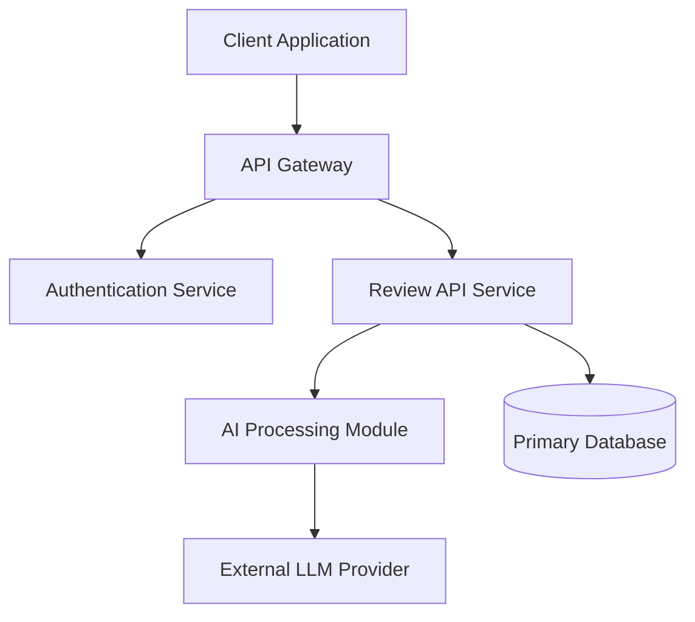

# ReviewFlow AI — Phase 0 Planning

## 1. Executive Summary
*Note: The master specification was referenced but not provided in the request. This document provides a structural template and foundational assumptions.*

ReviewFlow AI is envisioned as an AI-powered platform designed to streamline and automate the review process. This Phase 0 document outlines the essential planning artifacts required to move the project from conceptualization into active development, pending the provision and analysis of the complete master specification.

## 2. Functional Specification
*(Pending Master Specification)*
- **Core Engine:** Automated analysis and review generation.
- **User Management:** Authentication, authorization, and role-based access control.
- **Workflow Automation:** Pipeline for submitting, processing, and retrieving reviews.
- **Reporting:** Analytics dashboard for review metrics and insights.

## 3. Technical Specification
*(Pending Master Specification)*
- **Frontend:** Modern SPA framework (e.g., React, Next.js or Vue).
- **Backend:** Scalable API layer (e.g., Node.js, Python FastAPI).
- **AI Integration:** Integration with advanced LLM APIs (e.g., Gemini, Claude, or OpenAI).
- **Database:** Relational (PostgreSQL) or NoSQL (MongoDB) depending on data structure.

## 4. Architecture Diagram


## 5. System Component Diagram
```mermaid
componentDiagram
    package "Frontend" {
        [UI Dashboard]
        [Submission Interface]
    }
    package "Backend" {
        [User Controller]
        [Workflow Engine]
        [AI Integration Service]
    }
    package "Data Layer" {
        [User Store]
        [Review Store]
    }
    [Submission Interface] --> [Workflow Engine]
    [Workflow Engine] --> [AI Integration Service]
    [AI Integration Service] --> [Review Store]
```

## 6. User Flows
1. **Onboarding:** User registers and authenticates into the ReviewFlow AI platform.
2. **Submission:** User uploads or inputs the asset (document, code, product details) requiring review.
3. **Processing:** System queues the asset and processes it through the AI integration service.
4. **Delivery:** User receives the automated review, insights, and actionable feedback via the dashboard.

## 7. Risk Assessment
- **High Risk:** Scope creep and ambiguous requirements due to the missing master specification.
- **Medium Risk:** AI hallucinations or inconsistent quality in the generated reviews.
- **Medium Risk:** Data privacy and compliance issues, particularly if handling sensitive or proprietary data.
- **Low Risk:** Technology stack misalignment (can be mitigated during Phase 0 finalization).

## 8. Development Roadmap
- **Phase 0:** Project Discovery, Planning, and Specification Finalization (Current)
- **Phase 1:** Foundation (Architecture setup, Database schema, Authentication)
- **Phase 2:** Core Features (Submission workflows, API development, UI implementation)
- **Phase 3:** AI Integration (Prompt engineering, LLM pipeline, Context management)
- **Phase 4:** Beta Testing & Launch (QA, UAT, Production deployment)

## 9. Milestones
- [ ] **M1:** Receive and finalize the master specification.
- [ ] **M2:** Finalize Architecture and UI/UX design.
- [ ] **M3:** Complete foundational backend and frontend infrastructure.
- [ ] **M4:** Successfully integrate and test the AI Review Engine.
- [ ] **M5:** Official Beta Launch.

## 10. Task Breakdown
- [ ] **Project Management:** Review master specification, define agile sprints.
- [ ] **Design:** Create wireframes and high-fidelity mockups.
- [ ] **Backend:** Setup server, configure database, implement auth and core routes.
- [ ] **AI Integration:** Design prompts, implement LLM API calls, handle rate limiting.
- [ ] **Frontend:** Build UI components, integrate APIs, manage application state.
- [ ] **Testing:** Write unit, integration, and E2E tests.

---

### Ambiguities
**Primary Ambiguity:** The "master specification" was requested but not provided. As a result, the exact nature of the items being reviewed (e.g., code, legal documents, employee performance, products) and the specific target audience remain entirely undefined.

### Clarification Questions
1. Could you please provide the complete master specification or detail the specific use case and domain for ReviewFlow AI (e.g., what exactly is being reviewed)?
2. Do you have any strict preferences or constraints regarding the technology stack or specific AI models to be used?
3. What are the key success metrics or performance KPIs for the AI-generated reviews?

### Development Timeline Estimate
*(Preliminary Estimate: 8 to 12 weeks)*
- **Weeks 1-2:** Planning, Design, and Specification Finalization.
- **Weeks 3-5:** Backend and Frontend Foundation MVP.
- **Weeks 6-8:** AI Integration and Core Workflow Completion.
- **Weeks 9-12:** Testing, QA, Refinement, and Production Launch.
*Note: This is a rough estimate and will be refined upon receipt of the master specification.*
